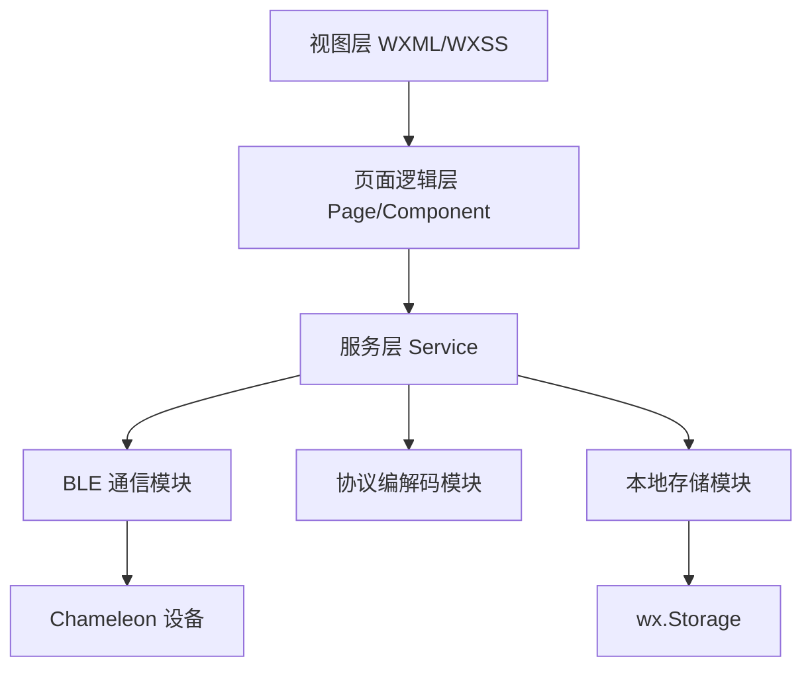
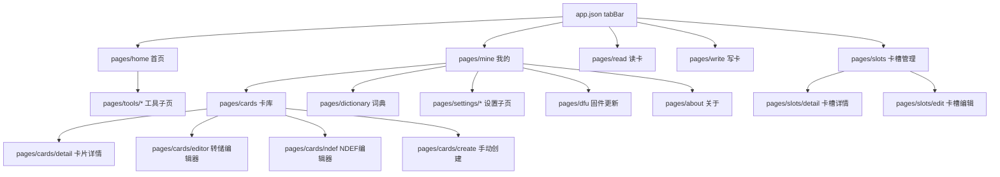
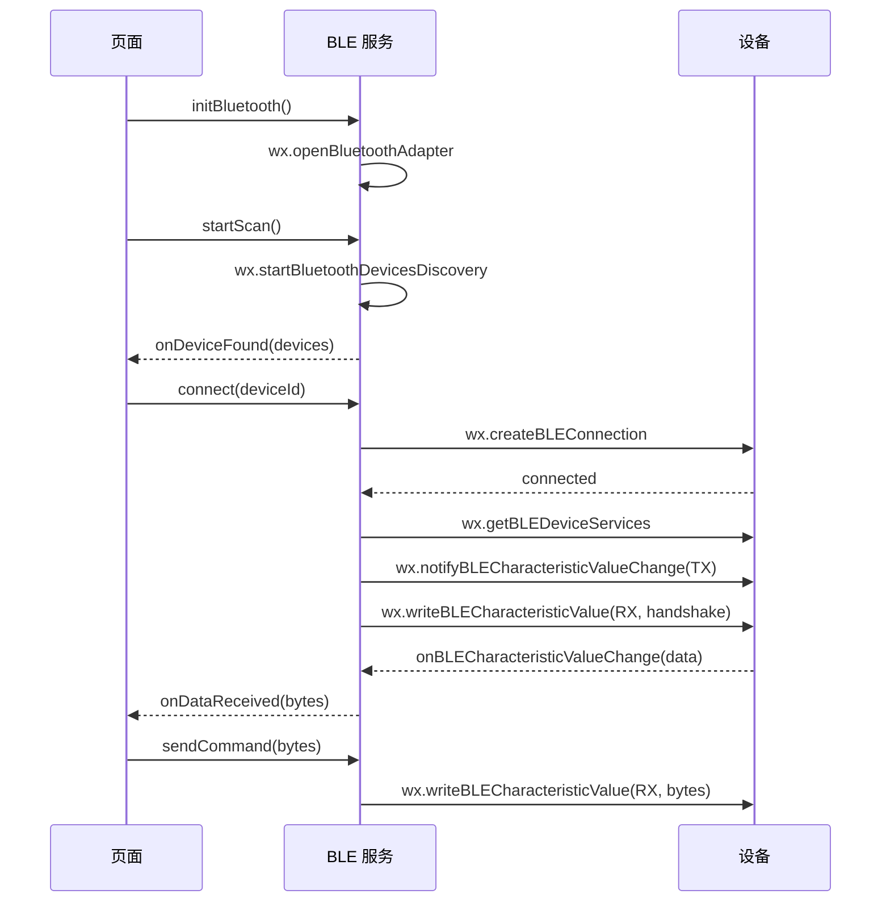
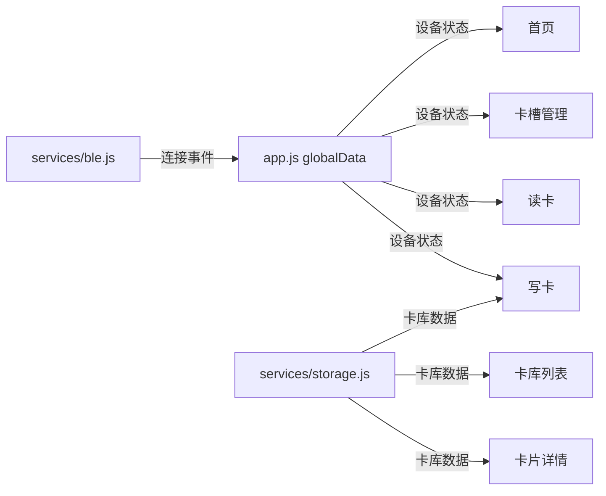

# ChameleonUltraGUI 微信小程序迁移 - 技术设计文档

Feature Name: wechat-miniprogram-migration
Updated: 2026-07-22

## 描述

将 Chameleon Ultra GUI Flutter 应用迁移为微信小程序，使用原生微信小程序框架（WXML + WXSS + JS），保留全部核心功能，重新设计深色赛博科技风格 UI，底部 5 标签栏导航。

## 架构

### 整体分层架构



### 页面路由结构



### BLE 通信流程



### 命令帧协议

Chameleon 设备使用固定长度 128 字节帧格式通信：

```
| 0x11 | 0xEF | CMD_H | CMD_L | STATUS | LEN_H | LEN_L | ... DATA ... |
|------+------+-------+-------+--------+-------+-------+---------------|
|  0   |  1   |   2   |   3   |   4    |   5   |   6   |   7..127      |
```

- 帧头: `0x11 0xEF`
- CMD_H/CMD_L: 命令号高/低字节
- STATUS: 响应状态（0x00=成功）
- LEN_H/LEN_L: 数据长度
- DATA: 可变长度数据

## 组件和接口

### 目录结构

```
miniprogram/
├── app.js                    # 全局应用
├── app.json                  # 路由、tabBar 配置
├── app.wxss                  # 全局样式
├── pages/
│   ├── home/                 # 首页（设备状态+快捷入口）
│   │   └── index.{js,wxml,wxss}
│   ├── slots/                # 卡槽管理
│   │   ├── index.{js,wxml,wxss}
│   │   ├── detail.{js,wxml,wxss}
│   │   └── edit.{js,wxml,wxss}
│   ├── read/                 # 读卡
│   │   └── index.{js,wxml,wxss}
│   ├── write/                # 写卡
│   │   └── index.{js,wxml,wxss}
│   ├── mine/                 # 我的
│   │   └── index.{js,wxml,wxss}
│   ├── cards/                # 卡库
│   │   ├── index.{js,wxml,wxss}
│   │   ├── detail.{js,wxml,wxss}
│   │   ├── editor.{js,wxml,wxss}
│   │   ├── ndef.{js,wxml,wxss}
│   │   └── create.{js,wxml,wxss}
│   ├── dictionary/           # 词典
│   │   ├── index.{js,wxml,wxss}
│   │   └── edit.{js,wxml,wxss}
│   ├── dfu/                  # 固件更新
│   │   └── index.{js,wxml,wxss}
│   ├── tools/                # 工具
│   │   ├── hf-sniff.{js,wxml,wxss}
│   │   ├── lf-sniff.{js,wxml,wxss}
│   │   ├── t55xx.{js,wxml,wxss}
│   │   ├── mfkey32.{js,wxml,wxss}
│   │   └── logs.{js,wxml,wxss}
│   ├── settings/             # 设置
│   │   ├── device.{js,wxml,wxss}
│   │   └── app.{js,wxml,wxss}
│   └── about/                # 关于
│       └── index.{js,wxml,wxss}
├── services/                 # 业务服务层
│   ├── ble.js                # BLE 连接管理
│   ├── protocol.js           # Chameleon 命令帧编解码
│   ├── commands.js           # 命令定义与封装
│   ├── storage.js            # wx.Storage 读写封装
│   └── firmware.js           # 固件下载
│   └── backup.js             # 卡片云端备份
│   └── activation.js          # 设备激活逻辑
├── components/               # 通用组件
│   ├── card-slot/            # 卡槽卡片组件
│   ├── device-picker/        # 设备选择器组件
│   ├── key-grid/             # 密钥检测网格组件
│   ├── progress-bar/         # 进度条组件
│   ├── loading-overlay/      # 加载覆盖层组件
│   └── action-sheet/         # 底部操作菜单组件
├── utils/                    # 工具函数
│   ├── hex.js                # 十六进制转换
│   ├── crc.js                # CRC 校验
│   └── constants.js          # UUID、命令常量
└── theme/                    # 主题配置
    └── colors.js             # 色值常量
```

### BLE 服务接口 (services/ble.js)

```javascript
class BLEService {
  // 初始化蓝牙适配器
  async initBluetooth()

  // 扫描设备，返回设备列表
  // devices: [{ deviceId, name, RSSI, advertisData }]
  async startScan(timeoutMs = 3000)
  stopScan()

  // 连接设备
  async connect(deviceId, isDFU = false)

  // 断开连接
  async disconnect()

  // 发送命令帧（自动包装帧头尾）
  async sendCommand(cmd, data = [])

  // 注册数据接收回调
  onDataReceived(callback)

  // 注册连接状态变化回调
  onConnectionStateChanged(callback)

  // 当前连接状态
  get isConnected()
  get currentDevice()
}
```

### 协议编解码接口 (services/protocol.js)

```javascript
class Protocol {
  // 构建命令帧
  static buildFrame(commandId, payload = [])

  // 解析响应帧
  static parseFrame(bytes)

  // 命令 ID 到命令对象的映射
  static COMMANDS
}
```

### 命令常量 (utils/constants.js)

```javascript
const CHAMELEON_COMMANDS = {
  GET_APP_VERSION:     0x1000,
  CHANGE_DEVICE_MODE:  0x1001,
  GET_DEVICE_MODE:     0x1002,
  SET_ACTIVE_SLOT:     0x1003,
  SET_SLOT_TAG_TYPE:   0x1004,
  SET_SLOT_DATA_DEFAULT: 0x1005,
  SET_SLOT_ENABLE:     0x1006,
  // ... 完整 80+ 命令
  BLE_SET_CONNECT_KEY: 0x1030,
  BLE_GET_CONNECT_KEY: 0x1031,
  // ...
};

const BLE_UUIDS = {
  NRF_SERVICE:  '6E400001-B5A3-F393-E0A9-E50E24DCCA9E',
  UART_TX:      '6E400002-B5A3-F393-E0A9-E50E24DCCA9E',
  UART_RX:      '6E400003-B5A3-F393-E0A9-E50E24DCCA9E',
  DFU_SERVICE:  '0000FE59-0000-1000-8000-00805F9B34FB',
  DFU_CONTROL:  '8EC90001-F315-4F60-9FB8-838830DAEA50',
  DFU_FIRMWARE: '8EC90002-F315-4F60-9FB8-838830DAEA50',
};
```

### 本地存储接口 (services/storage.js)

```javascript
class StorageService {
  // 卡库 CRUD
  async getCards(filter)
  async saveCard(cardData)
  async deleteCard(cardId)
  async updateCard(cardId, data)

  // 词典管理
  async getDictionaries()
  async getDictionary(name)
  async saveDictionary(name, entries)
  async deleteDictionary(name)

  // 用户设置
  async getSettings()
  async saveSettings(settings)

  // 导出/导入
  async exportAll()
  async importAll(jsonData)
}
```

## 数据模型

### 卡片数据 (CardSave)

```javascript
{
  id: String,           // 唯一标识
  name: String,         // 卡片名称
  type: String,         // 'mifare_classic' | 'ultralight' | 'ntag' | 'em410x' | 'hid' | ...
  uid: String,          // UID 十六进制字符串
  sak: Number,          // SAK 值
  atqa: String,         // ATQA 十六进制字符串
  ats: String,          // ATS 十六进制字符串（可选）
  keys: {               // MIFARE Classic 密钥
    A: [String],        // Key A 数组（80 个，每个 12 字符 hex）
    B: [String]         // Key B 数组
  },
  blocks: [[Number]],   // 块数据（MIFARE Classic: 扇区→块，Ultralight: 页）
  created: Number,      // 创建时间戳
  modified: Number      // 修改时间戳
}
```

### 卡槽配置 (SlotInfo)

```javascript
{
  index: Number,        // 0-79
  hfType: String,       // 'mifare_classic_1k' | 'ntag215' | 'disabled' | ...
  lfType: String,       // 'em410x' | 'hid' | 'disabled' | ...
  hfEnabled: Boolean,
  lfEnabled: Boolean,
  nickname: String
}
```

### 设备设置 (DeviceSettings)

```javascript
{
  animationMode: Number,   // 0-3
  sleepTimeout: Number,    // 5-60
  buttonA: {
    press: Number,         // 0-4
    longPress: Number
  },
  buttonB: {
    press: Number,
    longPress: Number
  },
  blePairingEnabled: Boolean,
  bleConnectKey: String    // 6 位数字
}
```

### 应用设置 (AppSettings)

```javascript
{
  themeColor: String,       // '#3AD9F7' 等
  autoScan: Boolean,
  autoConnect: Boolean,
  confirmDelete: Boolean,
  language: String,
  lastConnectedDevice: String,
  qrSettings: {
    splitSize: Number,
    errorCorrection: String
  }
}
```

### 云端备份接口 (services/backup.js)

```javascript
class BackupService {
  // POST /api/backup
  // 请求体: { chip_id, cards: [{ name, uid, tag_type, data, bin_data }] }
  // 成功响应: 201 { message, backup_id }
  async backupCards(chipId, cards)

  // 查询备份状态（写入本地存储标记）
  markBackupStatus(cards)
}
```

### 设备激活接口 (services/activation.js)

```javascript
class ActivationService {
  // 生成激活码: SHA256(chipId + ":" + "CHAMELEON_ULTRA_2024").前16位大写Hex
  static generateCode(chipId)

  // 格式化激活码: ABCD1234EF567890 → ABCD-1234-EF56-7890
  static formatCode(code)

  // 校验激活码: 去分隔符 → 16位Hex校验 → 与 generateCode 比对
  static validate(chipId, inputCode)

  // 查询激活状态
  static isActivated()

  // 保存激活状态
  static saveActivation(chipId)

  // 获取有效卡槽数: !isActivated() ? 8 : 80
  static getEffectiveSlotCount()
}
```

### 应用设置扩展 (AppSettings)

```javascript
{
  // ... 原有字段
  activated: Boolean,          // 是否已激活
  activatedChipId: String      // 已激活的设备芯片ID
}
```

### 数据库扩展：CardSave 增加备份字段

```javascript
{
  // ... 原有字段
  backupId: Number,       // 云端备份 ID（null = 未备份）
  isBackedUp: Boolean     // 是否已备份
}
```

## 页面间数据流



## 正确性约束

1. BLE 连接必须是单例，全局只有一个活跃连接
2. 命令帧发送必须串行，前一帧收到响应后才能发送下一帧
3. 所有十六进制字符串统一使用大写无空格格式
4. BLE 写入操作前必须确认特征值已发现（`wx.getBLEDeviceCharacteristics`）
5. 蓝牙适配器在页面销毁时无需关闭（保持后台连接）
6. 小程序后台 5 分钟后可能被挂起，需在 `onShow` 中检查连接状态
7. DFU 写入必须使用 `writeWithoutResponse`（`writeBLECharacteristicValue` 不等待响应即为 withoutResponse）

## 错误处理

| 场景 | 处理方式 |
|------|---------|
| 蓝牙未开启 | 提示用户开启蓝牙，提供系统设置跳转 |
| 扫描超时无设备 | 显示空状态页，提示靠近设备 |
| 连接失败 | 自动重试 5 次，失败后显示错误提示 |
| 命令超时（5 秒无响应） | 标记命令失败，显示重试按钮 |
| 写入失败 | 显示失败块编号，支持断点续写 |
| 固件下载失败 | 显示网络错误提示，允许重试 |
| 存储空间不足 | 提示用户清理卡库/词典数据 |
| 设备断开 | 自动弹出重连提示，显示断开原因 |
| DFU 刷写中断 | 提示设备可能变砖，提供恢复指引 |

## 测试策略

1. **BLE 通信测试**: 使用真实 Chameleon 设备验证连接、命令发送、数据接收
2. **命令协议测试**: 使用 mock BLE 设备验证帧编解码正确性
3. **卡库存储测试**: 验证卡片增删改查、大数据量（100+ 卡片）性能
4. **UI 测试**: 微信开发者工具模拟器验证所有页面布局和交互
5. **真机测试**: iOS/Android 真机验证蓝牙权限、UI 适配
6. **性能测试**: 嗅探大量数据时的 UI 渲染性能、内存占用
